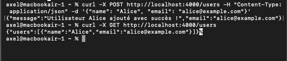

# 🚀 API Node.js avec TypeScript

Une API REST simple et performante développée avec **Node.js**, **Express** et **TypeScript**. Ce projet démontre les bonnes pratiques de développement backend avec une architecture claire et modulaire.

## 📋 Table des matières

- [Description](#-description)
- [Fonctionnalités](#-fonctionnalités)
- [Prérequis](#-prérequis)
- [Installation](#-installation)
- [Configuration](#-configuration)
- [Utilisation](#-utilisation)
- [Documentation des routes](#-documentation-des-routes)
- [Structure du projet](#-structure-du-projet)
- [Scripts disponibles](#-scripts-disponibles)
- [Tests](#-tests)
- [Technologies utilisées](#-technologies-utilisées)

---

## 📝 Description

Cette API permet de gérer une liste d'utilisateurs avec les opérations CRUD de base. Elle est construite avec TypeScript pour bénéficier du typage statique et d'une meilleure maintenabilité du code.

## ✨ Fonctionnalités

- ✅ Récupération de la liste des utilisateurs (GET)
- ✅ Ajout d'un nouvel utilisateur (POST)
- ✅ Validation des données entrantes
- ✅ Gestion des erreurs avec codes HTTP appropriés
- ✅ Stockage en mémoire (facilement extensible vers une base de données)
- ✅ Configuration via variables d'environnement
- ✅ Auto-rechargement en développement avec Nodemon

## 🔧 Prérequis

Avant de commencer, assurez-vous d'avoir installé :

- **Node.js** (version 14 ou supérieure) - [Télécharger Node.js](https://nodejs.org/)
- **npm** (inclus avec Node.js)
- **Git** (optionnel, pour cloner le projet)

Vérifiez vos installations :

```bash
node --version
npm --version
```

## 📦 Installation

### 1. Cloner ou télécharger le projet

```bash
cd /Users/axel/Downloads/api-node-ts
```

### 2. Installer les dépendances

```bash
npm install
```

Cette commande installera toutes les dépendances nécessaires définies dans `package.json` :
- **express** : Framework web pour Node.js
- **dotenv** : Gestion des variables d'environnement
- **typescript** : Langage de programmation typé
- **ts-node** : Exécution directe de fichiers TypeScript
- **nodemon** : Auto-rechargement lors des modifications
- **@types/express** et **@types/node** : Définitions de types TypeScript

## ⚙️ Configuration

### Fichier `.env`

Créez un fichier `.env` à la racine du projet (s'il n'existe pas déjà) :

```env
PORT=4000
```

Ce fichier permet de configurer :
- **PORT** : Le port sur lequel le serveur va écouter (par défaut : 4000)

> **Note** : Le fichier `.env` contient des informations sensibles et ne doit pas être versionné (ajouté au `.gitignore`).

## 🚀 Utilisation

### Démarrage en mode développement

Lance le serveur avec auto-rechargement lors des modifications de code :

```bash
npm run dev
```

Le serveur démarre sur `http://localhost:4000`

Vous devriez voir dans la console :
```
✅ Serveur démarré sur http://localhost:4000
```

### Compilation TypeScript

Compile les fichiers TypeScript en JavaScript dans le dossier `dist/` :

```bash
npm run build
```

### Démarrage en mode production

Après avoir compilé le projet, lancez la version compilée :

```bash
npm start
```

## 📡 Documentation des routes

### Route de base

#### `GET /`
Vérifie que l'API fonctionne correctement.

**Exemple de requête :**
```bash
curl http://localhost:4000/
```

**Réponse :**
```
🚀 API Node.js avec TypeScript fonctionne !
```

---

### Gestion des utilisateurs

#### `GET /users`
Récupère la liste de tous les utilisateurs.

**Exemple de requête :**
```bash
curl http://localhost:4000/users
```

**Réponse réussie (200) :**
```json
{
  "users": [
    {
      "name": "Alice",
      "email": "alice@example.com"
    },
    {
      "name": "Bob",
      "email": "bob@example.com"
    }
  ]
}
```

---

#### `POST /users`
Ajoute un nouvel utilisateur à la liste.

**Corps de la requête (JSON) :**
```json
{
  "name": "Charlie",
  "email": "charlie@example.com"
}
```

**Exemple de requête avec curl :**
```bash
curl -X POST http://localhost:4000/users \
  -H "Content-Type: application/json" \
  -d '{"name":"Charlie","email":"charlie@example.com"}'
```

**Réponse réussie (200) :**
```json
{
  "message": "Utilisateur Charlie ajouté avec succès !",
  "email": "charlie@example.com"
}
```

**Réponse d'erreur (400) - Champs manquants :**
```json
{
  "message": "Nom et email requis"
}
```

---

### 📋 Exemples de tests complets

**1. Vérifier que l'API est en ligne :**
```bash
curl http://localhost:4000/
```

**2. Récupérer la liste (vide au début) :**
```bash
curl http://localhost:4000/users
```

**3. Ajouter un premier utilisateur :**
```bash
curl -X POST http://localhost:4000/users \
  -H "Content-Type: application/json" \
  -d '{"name":"Alice","email":"alice@example.com"}'
```

**4. Ajouter un second utilisateur :**
```bash
curl -X POST http://localhost:4000/users \
  -H "Content-Type: application/json" \
  -d '{"name":"Bob","email":"bob@example.com"}'
```

**5. Vérifier que les utilisateurs sont bien ajoutés :**
```bash
curl http://localhost:4000/users
```

**6. Tester la validation (requête sans email) :**
```bash
curl -X POST http://localhost:4000/users \
  -H "Content-Type: application/json" \
  -d '{"name":"Charlie"}'
```

## 📂 Structure du projet

```
api-node-ts/
├── src/                          # Code source TypeScript
│   ├── index.ts                  # Point d'entrée de l'application
│   ├── controllers/              # Contrôleurs (logique métier)
│   │   └── user.controller.ts    # Gestion des utilisateurs
│   └── routes/                   # Définition des routes
│       └── user.routes.ts        # Routes utilisateurs
├── dist/                         # Code JavaScript compilé (généré)
├── node_modules/                 # Dépendances npm (généré)
├── .env                          # Variables d'environnement (à créer)
├── .gitignore                    # Fichiers à ignorer par Git
├── nodemon.json                  # Configuration de Nodemon
├── package.json                  # Métadonnées et dépendances du projet
├── package-lock.json             # Verrouillage des versions des dépendances
├── tsconfig.json                 # Configuration TypeScript
└── README.md                     # Documentation du projet (ce fichier)
```

### Détails des fichiers principaux

- **`src/index.ts`** : Initialise Express, configure les middlewares et démarre le serveur
- **`src/controllers/user.controller.ts`** : Contient la logique métier pour gérer les utilisateurs
- **`src/routes/user.routes.ts`** : Définit les routes HTTP et les associe aux contrôleurs
- **`tsconfig.json`** : Configure le compilateur TypeScript
- **`nodemon.json`** : Configure l'auto-rechargement en développement
- **`.env`** : Stocke les variables d'environnement (port, etc.)

## 📜 Scripts disponibles

Tous les scripts sont définis dans `package.json` :

| Script | Commande | Description |
|--------|----------|-------------|
| **dev** | `npm run dev` | Lance le serveur en mode développement avec auto-rechargement |
| **build** | `npm run build` | Compile le code TypeScript vers JavaScript |
| **start** | `npm start` | Lance le serveur en mode production (nécessite `npm run build` d'abord) |

## 🧪 Tests

### Tests manuels avec cURL

Voir la section [Documentation des routes](#-documentation-des-routes) pour des exemples complets de tests avec cURL.

### Tests avec Postman

Vous pouvez également tester l'API avec [Postman](https://www.postman.com/) :

1. Créez une nouvelle collection "API Node.js TS"
2. Ajoutez les requêtes suivantes :
   - **GET** `http://localhost:4000/users`
   - **POST** `http://localhost:4000/users` avec body JSON :
     ```json
     {
       "name": "Test User",
       "email": "test@example.com"
     }
     ```

## 🛠 Technologies utilisées

- **[Node.js](https://nodejs.org/)** - Environnement d'exécution JavaScript
- **[Express](https://expressjs.com/)** - Framework web minimaliste et flexible
- **[TypeScript](https://www.typescriptlang.org/)** - JavaScript avec typage statique
- **[dotenv](https://www.npmjs.com/package/dotenv)** - Gestion des variables d'environnement
- **[Nodemon](https://nodemon.io/)** - Outil de développement pour auto-rechargement
- **[ts-node](https://typestrong.org/ts-node/)** - Exécution directe de TypeScript

## 📸 Captures d'écran

### Image 1


### Image 2


---


